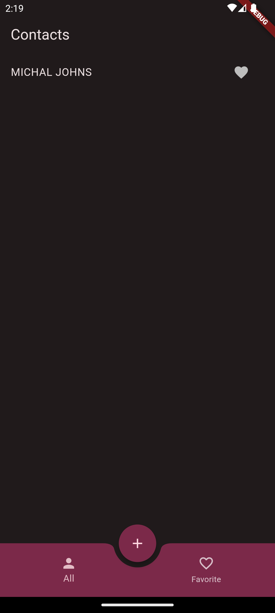

# Virtual Card App: Capture and Organize Contacts

An app that is designed to scan buisness card and extract the data from it to save it on mobile local storage for performing different operations such as sending calls, messages, etc.

**Key Features:**

- **Card Scanning:** Scan business cards with ease using your device's camera or gallery.
- **Accurate Text Extraction:** Powered by Google ML Kit, the app accurately extracts details like name, contact number, email address, address, company, and designation.
- **Customizable Contact Management:** Edit and organize your scanned contacts, ensuring all information is readily accessible.
- **Integrated Communication:** Initiate calls, send messages, or view locations on saved contacts directly from the app (functionality based on available methods on your device).
- **Light & Dark Themes:** Choose a theme that suits your preference for optimal viewing.

**Packages used:**

* GoRouter (for navigation)
* Provider (for state management)
* Camera package (for camera access)
* Image picker package (for gallery access)
* Google ML Kit Text Recognition (for text extraction)
* Sqflite (for local database storage) 

**A Glimpse of the App's Interface:**

**Home Screen:**

  - A clean and user-friendly interface for capturing virtual cards.

  
  

**Image Picking Methods:**

  - Flexible options for choosing how to capture card details.

  
  

**Image Scan Screen:**

  - Focus on capturing a clear image of the business card for optimal text recognition results.

  

**Scanned Data Screen:**

  - Review the extracted contact details before saving them.

  
  

**Edit Contact Screen:**

  - Edit and personalize the extracted information for accuracy.

  
  

**Contact Details Screen:**

  - Manage and interact with your saved contacts.
  - Click on the below five buttons to perform some operations like make call or view location, etc.

  
  

